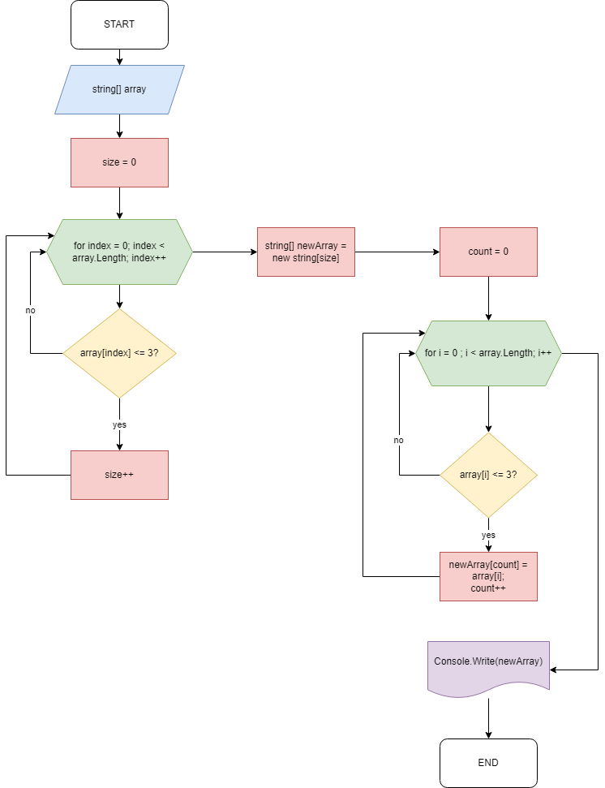

# Итоговая проверочная работа
##### *Данная работа сделана по итогу прохождения первого блока обучения в GeekBrains*
***
## Задача 
Написать программу, которая из имеющегося массива строк формирует массив из строк, длина которых меньше или равна 3 символа. 
***
### Решение
Изначально создаём блок-схему алгоритма, которая будет отображать основной принцип работы программы.

 *Для создания блок-схемы использовался [данный сайт.](https://app.diagrams.net/)*

Следующим этапом пишем программу, которая будет включать в себя несколько методов:

+ Ввод строк в основной массив
+ Определение размера нового массива
+ Поиск необходимых элементов, которые нужно добавить в новый массив
+ Печать результата